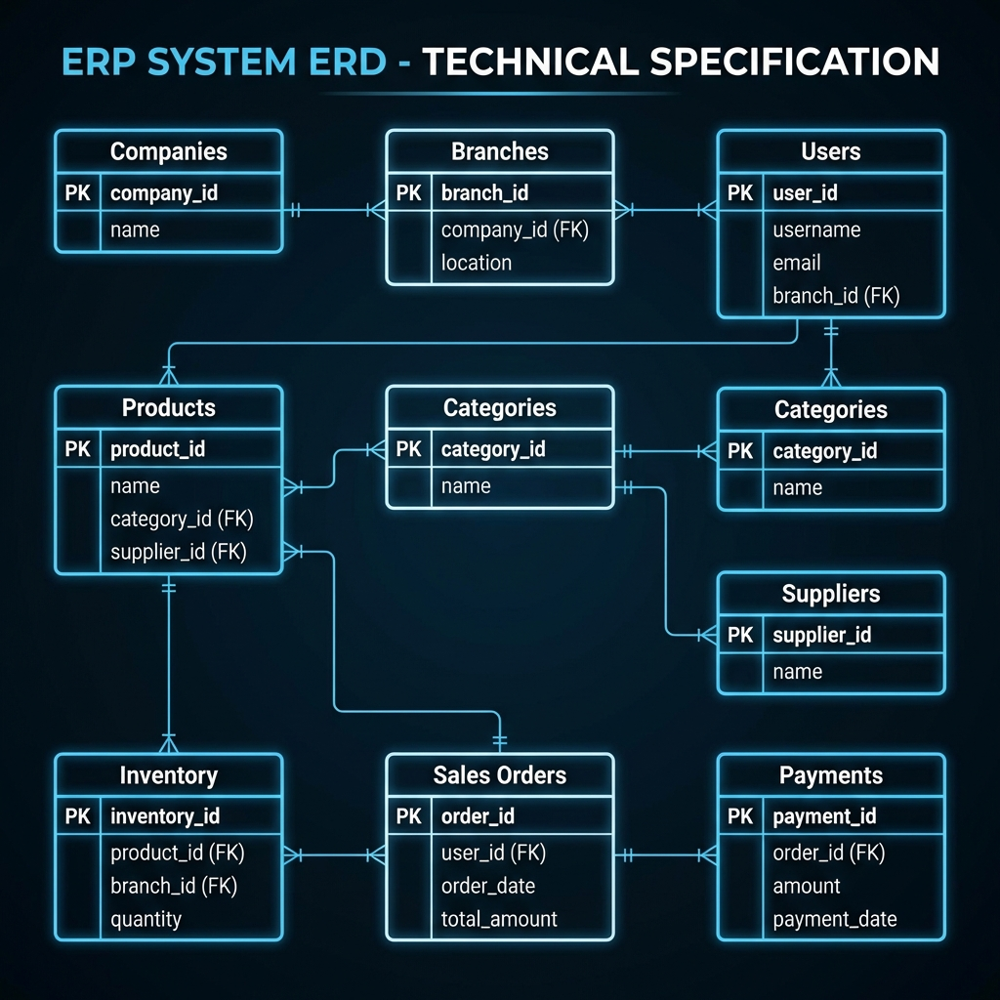
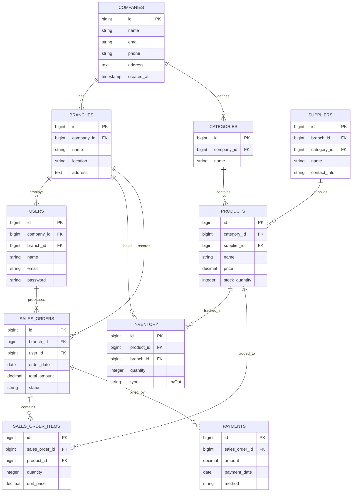

# 📊 ERP System - Detailed Entity Relationship Diagram (ERD)

هذا الرسم يوضح الجداول مع الحقول (Fields) والعلاقات (Relationships) بشكل تفصيلي بنفس أسلوب الصورة التي أرفقتها.

## 🗝️ ملاحظات على التصميم (Technical Notes):

1.  **Multi-Tenancy**: تبدأ العلاقة من `COMPANIES` التي تملك الفروع والأصناف.
2.  **Inventory Ledger**: جدول `INVENTORY` يعمل كسجل لكافة الحركات (Stock Movements).
3.  **Sales Flow**: يتم ربط الفاتورة (`SALES_ORDERS`) بالفرع والمستخدم والمدفوعات.

> [!TIP]
> تم تحديث هذا المخطط ليعكس بنية النظام الحالية والمستهدفة كما هو موضح في الـ [ROADMAP](file:///home/muhammad/Downloads/Laravel%20API-First/ERPSystem/ROADMAP.md).
