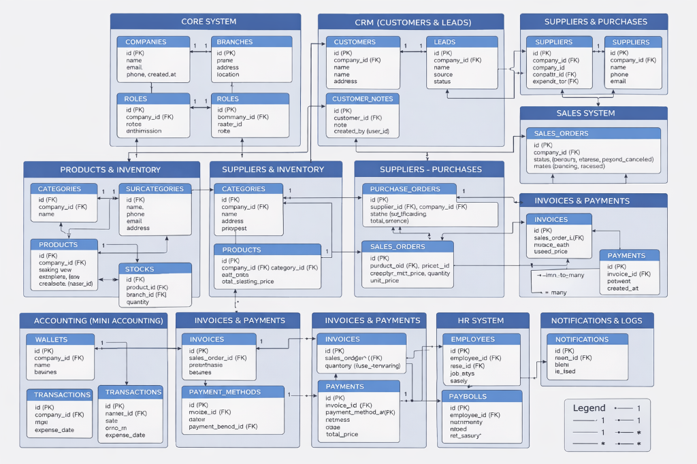
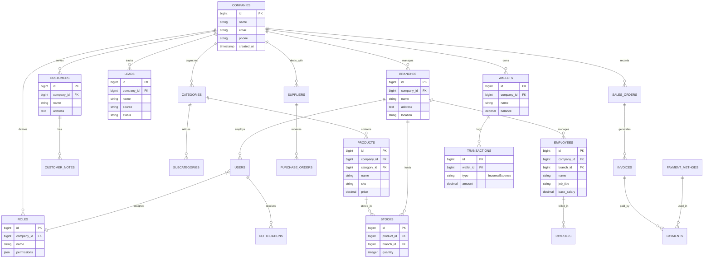

# 📊 ERP System - Comprehensive Entity Relationship Diagram (ERD)



هذا الرسم يوضح الهيكلية المتكاملة للنظام (Full ERP Architecture) والتي تشمل أنظمة فرعية (CRM, HR, Accounting, etc.).



---

## 🚀 Implementation Commands | أوامر التنفيذ (Laravel API-First)

استخدم الأوامر التالية لإنشاء النظام بالكامل برمجياً مع الـ Controllers داخل مجلد `Api`:

### 1️⃣ Core & Business Structure
```bash
# Company, Branch, Role
php artisan make:model Company -mfs --api --requests
php artisan make:model Branch -mfs --api --requests
php artisan make:model Role -mfs --api --requests
```

### 2️⃣ CRM (Customers & Leads)
```bash
# Customer, Lead, Note
php artisan make:model Customer -mfs --api --requests
php artisan make:model Lead -mfs --api --requests
php artisan make:model CustomerNote -mfs --api --requests
```

### 3️⃣ Products & Inventory
```bash
# Category, Subcategory, Product, Stock
php artisan make:model Category -mfs --api --requests
php artisan make:model Subcategory -mfs --api --requests
php artisan make:model Product -mfs --api --requests
php artisan make:model Stock -mfs --api --requests
```

### 4️⃣ Sales & Purchases
```bash
# SalesOrder, PurchaseOrder, Supplier
php artisan make:model SalesOrder -mfs --api --requests
php artisan make:model PurchaseOrder -mfs --api --requests
php artisan make:model Supplier -mfs --api --requests
```

### 5️⃣ Accounting & Payments
```bash
# Wallet, Transaction, Invoice, Payment, PaymentMethod
php artisan make:model Wallet -mfs --api --requests
php artisan make:model Transaction -mfs --api --requests
php artisan make:model Invoice -mfs --api --requests
php artisan make:model Payment -mfs --api --requests
php artisan make:model PaymentMethod -mfs --api --requests
```

### 6️⃣ HR System & Notifications
```bash
# Employee, Payroll, Notification
php artisan make:model Employee -mfs --api --requests
php artisan make:model Payroll -mfs --api --requests
php artisan make:model Notification -mfs --api --requests
```

> [!IMPORTANT]
> - جميع الـ Controllers سيتم إنشاؤها تلقائياً داخل **`app/Http/Controllers/Api/`** عند تشغيل الأوامر بالترتيب.
> - الـ Migrations جاهزة لتعريف العلاقات كما في المخطط أعلاه.
